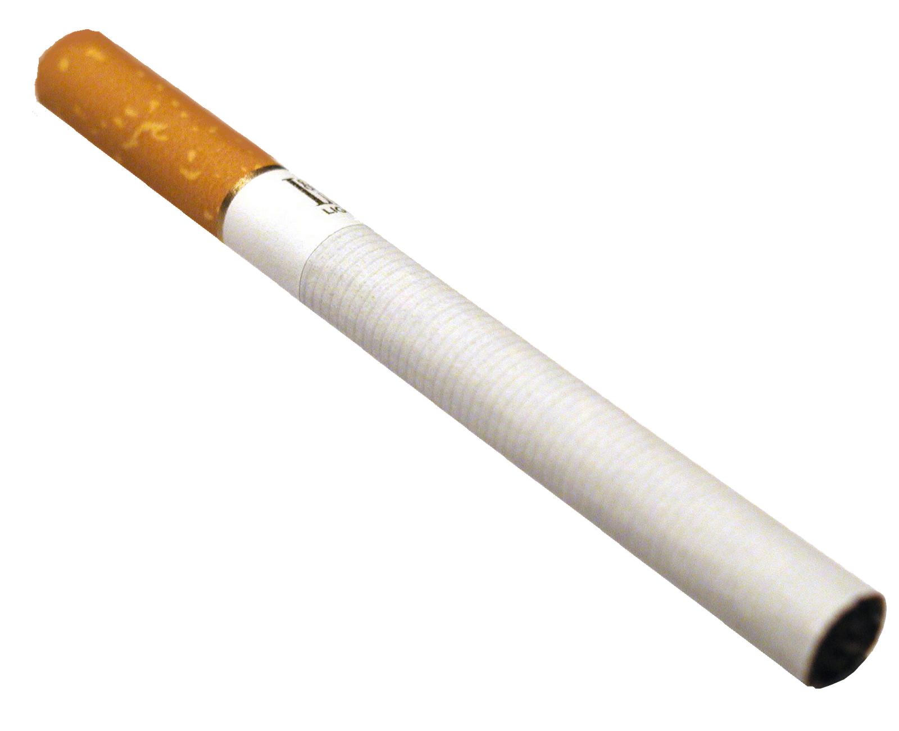

# Система Нагадувань для Перекурів та Інших Важливих Справ

<p align="center">
  
</p>

> I've told you as well as I can how it is to be an institutional man. At first you can't stand those four walls, then you get so you can abide them, then you get so you accept them... and then, as your body and your mind and your spirit adjust to life on an HO scale, you get to love them. You are told when to eat, when you can write letters, when you can smoke. If you're at work in the laundry or the plate-shop, you're assigned five minutes of each hour when you can go to the bathroom. For thirty-five years, my time was twenty-five minutes after the hour, and after thirty-five years, that's the only time I ever felt the need to take a piss or have a crap: twenty-five minutes past the hour. And if for some reason I couldn't go, the need would pass at thirty after, and come back at twenty-five past the next hour.
> <...>
> Going to the bathroom, that was another thing. When I had to go (and the urge always came on me at twenty-five past the hour), I had to fight the almost overwhelming need to check it with my boss. Knowing that was something I could just go and do in this too- bright outside world was one thing; adjusting my inner self to that knowledge after all those years of checking it with the nearest screw head or facing two days in solitary for the oversight... that was something else.

-- "Rita Hayworth and the Shawshank Redemption", Stephen King

**АГА! ТО ТИ, САЛАГА, ВИРІШИВ СОБІ НАГАДУВАЛКУ ПОСТАВИТИ? ПРАВИЛЬНО РОБИШ!**

Слухай сюди, боєць! Це тобі не якась там віндовська хуйня, а нормальна лінуксова система нагадувань, яку я, старший майстер-сержант Вася Заєбко, особисто випробував на собі за 20 років служби! Працює на X.org/Cinnamon, як годинник швейцарський... тьху, як годинник УКРАЇНСЬКИЙ!

## 🚬 Нахуя воно тобі треба

### Демон-нагадувач (як прапорщик, тільки корисніший)
- **Невидимий, як снайпер в кущах** - Сидить тихо, не виїбується в треї
- **Працює тільки в робочі часи** - Понеділок-п'ятниця, 8:00-18:59 (в суботу-неділю навіть я відпочиваю, бля)
- **Точний, як артилерія** - Показує картинки рівно в XX:47:00 та XX:50:00
- **Клікнув - і пішло нахуй** - Один клік мишкою і нема того вікна
- **Мультимоніторна підтримка** - Працює навіть якщо у тебе моніторів більше, ніж у генерала зірок
- **Не ховається за панелями** - Не як той рядовий Петренко за БТРом

### Відображення PNG в кутку
- **Прозорість, як совість політика** - Повна підтримка альфа-каналу
- **Гнучке позиціонування** - Любий кут екрану, як тобі зручно
- **Клікнув - закрив** - Простіше тільки калаш розібрати
- **Регулювання прозорості** - Від невидимого до щільного, як броня танка
- **Режим примари** - Можна зробити так, щоб клікати крізь нього
- **Можна тягати** - Як ящики з патронами (версія Tkinter)

## 📋 Що треба, щоб ця хуйня запрацювала

### Системні вимоги (не переживай, це не так страшно)
- Linux з X.org (перевірено на Cinnamon, але має працювати і на іншому)
- Python 3.6+ (якщо старіший - йди апгрейдись, салага!)
- GTK 3.0+ (має бути вже встановлено, якщо ні - то що ти взагалі робиш?)

### Встановлення залежностей

```bash
# Для GTK версії (рекомендую, бо нормальна)
sudo apt install python3-gi python3-gi-cairo gir1.2-gtk-3.0

# Для Tkinter версії (запасний варіант, як суха пайка)
pip install pillow
```

## 🚀 Швидкий старт (для тих, кому ліньки читати далі)

### Демон нагадувань про перекур

```bash
# Тестовий режим - показує кожні 10 секунд (для перевірки)
python3 reminder-daemon.py cigarette.png coffee.png --test

# Бойовий режим - показує о XX:47 та XX:50 в робочі години
python3 reminder-daemon.py perekur.png rozpryamys.png

# Запустити в фоні (і забути про нього)
nohup python3 reminder-daemon.py cigarette.png standup.png &
```

### Картинка в кутку екрана

```bash
# Базове використання - показує в правому нижньому куті
python3 corner-png-gtk.py logo_bat'ka.png

# Свої налаштування позиції та розміру
python3 corner-png-gtk.py gerb.png --corner top-left --size 128 128

# Напівпрозорий водяний знак (щоб начальство бачило, що ти працюєш)
python3 corner-png-gtk.py watermark.png --opacity 0.5 --clickthrough
```

## 📖 Детальний мануал (для тих, хто любить інструкції)

### Опції демона нагадувань

Слухай уважно, салага, бо повторювати не буду!

```
Параметри, бля:
  image1                Картинка для показу о XX:47:00 (час покурити)
  image2                Картинка для показу о XX:50:00 (час розім'ятися)

Додаткові прибамбаси:
  --corner             Де показувати (top-left, top-right, bottom-left, bottom-right)
  --offset             Відступ від краю в пікселях (стандарт: 20)
  --size WIDTH HEIGHT  Змінити розмір картинок (якщо треба)
  --opacity            Прозорість 0.0-1.0 (0 - невидима, 1 - як бетон)
  --sound              Звуковий файл (щоб точно не проспав)
  --test               Тестовий режим - показує кожні 10 секунд
```

## ⚙️ Налаштування (для розумних)

### Автозапуск при вході в систему

Створи файл, салага:

```bash
nano ~/.config/autostart/work-reminder.desktop
```

І запхай туди оце:

```ini
[Desktop Entry]
Type=Application
Name=Нагадування про перекур
Comment=Показує нагадування в робочі години, щоб ти не забув відпочити
Exec=/usr/bin/python3 /шлях/до/reminder-daemon.py /шлях/до/cigarette.png /шлях/до/coffee.png
Hidden=false
NoDisplay=false
X-GNOME-Autostart-enabled=true
StartupNotify=false
```

### Свій розклад (якщо стандартний не подобається)

Відкривай `reminder-daemon.py` і міняй метод `get_reminder_type`:

```python
def get_reminder_type(self, dt):
    minute = dt.minute
    second = dt.second
    
    # Кожну годину - покурити
    if minute == 0 and second == 0:  
        return 1
    # Кожні півгодини - кава
    if minute == 30 and second == 0:  
        return 2
    # О 14:20 - особливий час (сам знаєш чому)
    if dt.hour == 14 and minute == 20 and second == 0:
        return 1
    
    return None
```

## 🎨 Випадки використання (з армійського досвіду)

### Нагадування про перекур
- Картинка 1: Цигарка о XX:47 (3 хвилини до перерви)
- Картинка 2: Кава о XX:50 (час зробити каву)

### Фізична підготовка
- Картинка 1: "Віджимання" о XX:00
- Картинка 2: "Присідання" о XX:30

### Нагадування про наряди... тобто мітинги
- Картинка 1: "Планьорка" о 09:45
- Картинка 2: "Звіт командиру" о 17:45

## 🐛 Якщо щось пішло по пизді (Troubleshooting)

### Картинки з'являються не в тому куті
- Запусти `debug-corners.py` - побачиш де проблема
- Перевір чи панелі Cinnamon нормально налаштовані
- Якщо нічого не допомагає - перевстанови систему (жартую, бля!)

### Нагадування не з'являється
- Перевір системний час (має бути правильний)
- Глянь чи зараз робочі години (Пн-Пт 8-18)
- Використай `--test` режим для перевірки
- Перевір чи шляхи до картинок правильні (абсолютні, а не відносні, салага!)

### Click-through не працює
- Не всі віконні менеджери це підтримують
- GTK версія працює краще ніж Tkinter
- Якщо нічого не виходить - забий хуй

### Високе навантаження CPU
- Нормально має бути < 0.1%
- Якщо більше - зменши розмір картинок
- Перевір чи не запущено 100500 копій

## 🔧 Фічі для просунутих бійців

### Кілька наборів нагадувань
```bash
# Нагадування про перекур
python3 reminder-daemon.py cigarette.png coffee.png --offset 20 &

# Нагадування випити води (бо здоров'я важливе!)
python3 reminder-daemon.py water1.png water2.png --offset 100 &

# Нагадування подзвонити дружині (щоб не отримати по голові)
python3 reminder-daemon.py wife_call.png flowers.png --offset 180 &
```

### Звукові сповіщення (щоб точно почув)
```bash
python3 reminder-daemon.py img1.png img2.png \
    --sound /usr/share/sounds/freedesktop/stereo/artillery.oga
```

## 📝 Ліцензія

Користуйся як хочеш, тільки якщо зламається - сам винен!

## 💡 Поради від сержанта

1. **Формат картинок**: PNG з прозорістю - найкраще
2. **Розмір картинок**: Не більше 500x500px (нахуя тобі більше?)
3. **Тестуй спочатку**: Завжди використовуй `--test` перед автозапуском
4. **Логи**: При запуску через `nohup`, дивись логи в `/tmp/reminder.log`
5. **Декілька моніторів**: Вікно з'явиться там, де твоя мишка
6. **Не забувай**: Перекур - свята справа, але не забувай працювати!

## 🆘 Підтримка

Якщо щось не працює:
1. Перечитай інструкцію, салага!
2. Перевір чи все встановлено
3. Запусти debug скрипт
4. Якщо нічого не допомогло - ну бля, напиши мені

---

*Пам'ятай, боєць: регулярні перерви - запорука продуктивності! А тепер ВІДСТАВИТИ СИДІТИ - йди покури! 🚬*

**P.S.** від сержанта Заєбка: Якщо начальство питає, чому в тебе цигарка на екрані - скажи, що це мотиваційна картинка для боротьби з курінням. Працює в 9 випадках з 10!